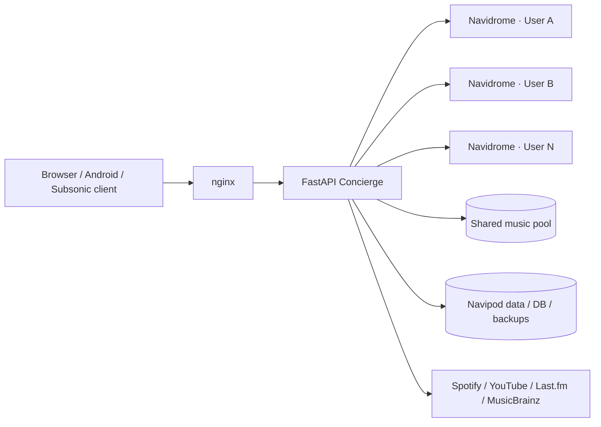

<p align="center">
  
</p>

# Navipod

**Your self-hosted music universe.**  
One place for your library, discovery, shared listening and personal Navidrome instances.


[**Get started**](#quick-start) · Documentation · Deployment · [Android APK](https://github.com/sPROFFEs/Navipod/releases)


Navipod is a personal, self-hosted music platform built around isolated **Navidrome instances per user**, a central **FastAPI concierge**, and a shared music pool. It brings your local library together with discovery from **YouTube, Spotify, Last.fm and MusicBrainz**, while keeping the server under your control.

> \[!IMPORTANT\]  
> Navipod is licensed for **private, personal, non-commercial use only**. It is not an open-source license. See [LICENSE](LICENSE) for the binding terms.

## Why Navipod?

<div class="joplin-table-wrapper"><table style="min-width: 50px"><tbody><tr><td colspan="1" rowspan="1"><h3 data-id="nglscjldgfgs" id="nglscjldgfgs">🎧 Search beyond your library</h3><p data-id="uwgwmprvgphw">Search local music and remote providers from one interface, preview results, download tracks and enrich metadata without jumping between services.</p></td><td colspan="1" rowspan="1"><h3 data-id="csqfuhvbbphn" id="csqfuhvbbphn">👤 Isolated multi-user streaming</h3><p data-id="mznrunftvyag">Each user gets an isolated Navidrome container while Navipod handles orchestration, shared storage and the surrounding experience.</p></td></tr><tr><td colspan="1" rowspan="1"><h3 data-id="qnyylvhddoah" id="qnyylvhddoah">🎉 Party Rooms</h3><p data-id="wrzmsxaiwdwy">Create synchronized listening rooms with a shared queue, host controls, playlist seeding and optional guest additions from the local library.</p></td><td colspan="1" rowspan="1"><h3 data-id="pnhkgcsyxxjv" id="pnhkgcsyxxjv">🧠 Personal mixes</h3><p data-id="uobqoavdeegy">Repeat, Deep Cuts, Favorites and Rediscovery mixes sit alongside recommendations and smart playlists that react to your library.</p></td></tr><tr><td colspan="1" rowspan="1"><h3 data-id="jmqytkxyvxio" id="jmqytkxyvxio">📱 Web, Android &amp; Subsonic</h3><p data-id="mecveitxkuhc">Use the web app, the native Android wrapper, or connect compatible Subsonic clients such as Amperfy, Tempo and Symfonium.</p></td><td colspan="1" rowspan="1"><h3 data-id="uqervmhthzaz" id="uqervmhthzaz">🛠️ Built-in operations</h3><p data-id="bqfthbdtrofh">Admin tools cover users, library health, metadata rescans, rotating backups, monitoring and in-app updates.</p></td></tr></tbody></table></div>

## See it in action

<table>
  <tr>
    <td width="50%" align="center">
      
      <br />
      <strong>Public</strong>
      <br />
      <sub>Share playlists with other users on the server.</sub>
    </td>
    <td width="50%" align="center">
      
      <br />
      <strong>Search</strong>
      <br />
      <sub>Local and remote discovery in one place.</sub>
    </td>
  </tr>
  <tr>
    <td width="50%" align="center">
      
      <br />
      <strong>Party</strong>
      <br />
      <sub>Synchronized playback and a shared queue.</sub>
    </td>
    <td width="50%" align="center">
      
      <br />
      <strong>Mobile</strong>
      <br />
      <sub>Android wrapper with system media controls.</sub>
    </td>
  </tr>
</table>


## Highlights

- **Multi-user by design** — isolated Navidrome containers managed by the concierge service.
- **Unified discovery** — local tracks plus YouTube, Spotify, Last.fm and MusicBrainz.
- **Shared download pool** — deduplication, metadata enrichment and reusable downloads.
- **Library views** — searchable and paginated artists, albums and genres.
- **Smart playlists** — editable rules, previews and automatic refreshes.
- **Party Rooms** — synchronized playback, room queues and host/guest controls.
- **Subsonic compatibility** — connect established mobile clients to each user's Navidrome instance.
- **Self-hosting operations** — updates, backups, monitoring and library maintenance from the admin UI.

## How it works



The standard Docker stack contains the **concierge**, **nginx**, and an optional **Cloudflare Tunnel** connector. Persistent data is stored under `/opt/saas-data` by default. See Architecture for the full picture.

## Quick Start

### Requirements

- Linux host
- Docker Engine + `docker compose`
- 2+ CPU cores and 4 GB RAM recommended
- SSD-backed storage recommended
- A domain + Cloudflare account only if using the default tunnel deployment

### Default deployment: Cloudflare Tunnel

```bash
git clone https://github.com/sPROFFEs/Navipod
cd Navipod/Navipod
cp .env.example .env
nano .env   # set SECRET_KEY, TUNNEL_TOKEN and DOMAIN
chmod +x setup.sh && ./setup.sh
```

`setup.sh` checks Docker, prepares `/opt/saas-data`, builds the stack and can create the first admin user and import an existing library.

For LAN/VPN and direct-domain deployments, use the dedicated guide instead of adapting the default stack by hand.

## Deployment modes

| Mode | Best for | TLS | Public IP required |
| --- | --- | --- | --- |
| **Cloudflared** _(default)_ | Easiest remote access | Cloudflare edge | No  |
| **Internal** | LAN / VPN / development | None — HTTP only | No  |
| **Domain** | Full control with your own public endpoint | Let's Encrypt | Yes |

→ Choose and configure a deployment mode

## Documentation

| Guide | What it covers |
| --- | --- |
| Installation | First install, requirements and first login |
| Deployment | Cloudflared, internal HTTP and own-domain TLS |
| Configuration | `.env`, providers, cookies and metadata |
| User Guide | Home, search, library, mixes and everyday use |
| Party Rooms | Rooms, permissions, sync and limits |
| Importing Music | Bulk import into the shared pool |
| Android | APK installation and mobile behavior |
| Subsonic | Connecting third-party Subsonic clients |
| Administration | Users, health, updates and operations |
| Backup & Restore | UI and host-level backup strategy |
| Troubleshooting | Common deployment and runtime problems |
| Architecture | Services, data flow and storage |
| Security | Deployment and credential security notes |

## Tech stack

**Backend:** Python · FastAPI  
**Music server:** Navidrome  
**Runtime:** Docker · Docker Compose · nginx  
**Discovery:** Spotify · YouTube · Last.fm · MusicBrainz  
**Remote access:** Cloudflare Tunnel or direct TLS deployment  
**Clients:** Web · Android · Subsonic-compatible apps

## Repository layout

```text
Navipod/
├── README.md
├── LICENSE
├── docs/
├── .github/
│   └── assets/
└── Navipod/
    ├── assets/
    ├── concierge/
    ├── deployment-templates/
    ├── docker-compose.yaml
    ├── nginx.conf
    ├── setup.sh
    └── .env.example
```

## License

Navipod uses a custom **Personal Use Only** license. Private, personal, non-commercial use and modification are allowed. Commercial use, redistribution, sublicensing and offering Navipod as a hosted service are prohibited without prior written permission.

Read the complete [LICENSE](LICENSE) before deploying or modifying the project.
