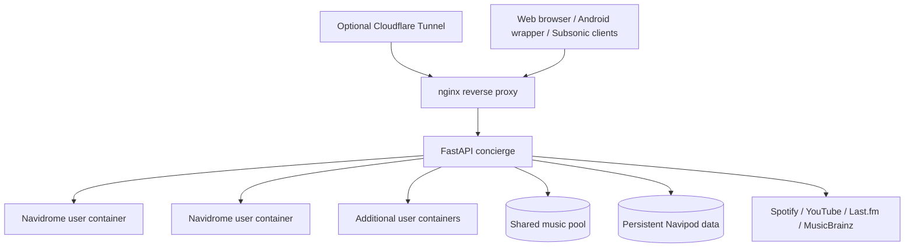

# Architecture

Navipod is a Docker-based control layer around per-user Navidrome instances, shared music storage and external discovery providers.

## High-level view



## Standard Compose services

The shipping `Navipod/docker-compose.yaml` documents these main services:

### `concierge`

FastAPI backend and orchestration layer. It manages the Navipod application experience and coordinates per-user Navidrome instances, shared data, provider integrations and admin operations.

### `nginx`

Reverse proxy in front of the application and user routes.

### `tunnel`

Optional Cloudflare Tunnel connector in the default public deployment.

Alternative deployment templates can change how traffic reaches nginx while preserving the standard live filenames expected by project tooling.

## Per-user Navidrome

Navipod's multi-user model isolates user music-server instances rather than treating all users as accounts inside one shared Navidrome process. The concierge is responsible for orchestrating those user containers and connecting the surrounding Navipod experience to them.

## Shared music pool

Downloaded/imported music is stored in a shared pool. This enables deduplication and reuse across users rather than storing a separate physical copy for every user discovery/download flow.

The project documents duplicate detection based on source/hash/fingerprint information.

## Provider integrations

Navipod can integrate with:

- YouTube;
- Spotify;
- Last.fm;
- MusicBrainz.

These integrations support discovery and metadata behavior around the local library. Provider credentials configured through the UI are encrypted at rest using the deployment `SECRET_KEY`.

## Persistent storage

The default host root is:

```text
/opt/saas-data
```

It contains persistent application state such as the database, cache, user-related data, shared pool and backups. The exact internal structure may evolve, so operational tooling should rely on documented application paths rather than hard-coding undocumented subdirectories.

## Request paths

A simplified request flow is:

```text
Client
  ↓
nginx
  ↓
Navipod concierge / routed user service
  ↓
Navidrome, shared storage or remote provider
```

Subsonic clients use a user-specific server path:

```text
https://your-domain/<username>
```

## Operational implications

- The concierge has privileged access to Docker for user-container orchestration.
- Persistent data must be backed up separately from the Git working tree.
- Deployment templates replace the standard live Compose/nginx files so the updater can continue using the normal commands.
- `SECRET_KEY` should be treated as durable recovery material, not an easily rotated cosmetic setting.

## Related guides

- [Deployment](DEPLOYMENT.md)
- [Configuration](CONFIGURATION.md)
- [Security](SECURITY.md)
- [Backup & Restore](BACKUP-RESTORE.md)
